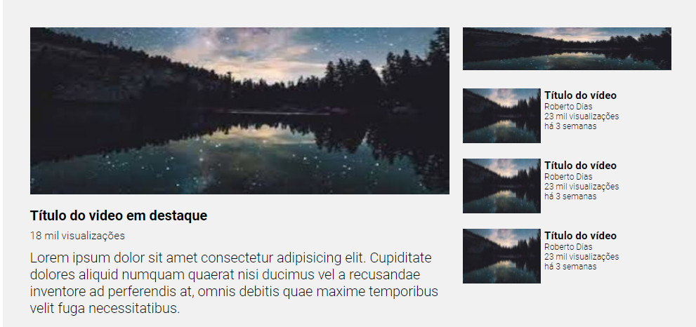

# layout-similar-youtube-com-css

Desafio proposto pelo curso de desenvolvimento web DevQuest com o objetivo de simular o layout de reprodução de vídeos do youtube utilizando as propriedades grid e flex com CSS.

Não adicionei links reais as imagens que representa a tumb dos vídeos pois o objetivo proposto foi testar na prática os aprendizados de posicionamento dos elementos em tela utilizando display grid e flex.

## Tecnolocias utilizadas 
- HTML
- CSS